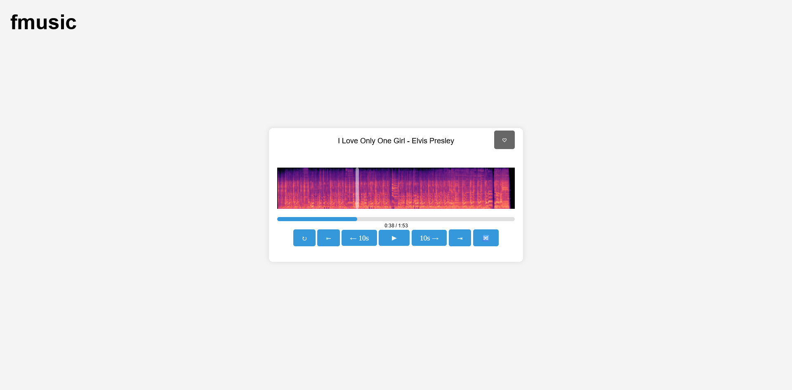
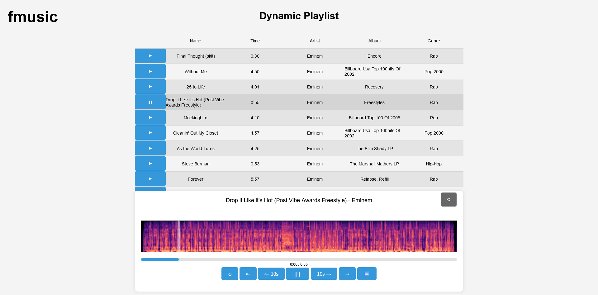

# fmusic

## Description

A simple music player for the web.

## Features

- [x] Dynamic playlist (by filters)
- [x] Play, pause, next, previous, shuffle, repeat
- [ ] Volume control
- [ ] Equalizer
- [ ] Playlists
- [x] Search
- [x] Favorites
- [ ] Recommendations
- [x] Spectrogram
- [ ] Waveform
- [ ] Play next

## Future Plans:

all of these are just ideas and may never be implemented.

- overall better performance (especially for the spectrogram)
- some kind of audio embedding to calculate a vector for each song and use it for recommendations
- a better way to update the music database
- switch to a js framework for the frontend
- API integrations to get lyrics, album covers, and missing metadata from other sources

## Implementation

The Backend is written in FastApi and the Frontend in pure html, css and js.
a simple sqlite database is used to store the music library.

## Installation

run `pip install -r requirements.txt` to install the dependencies.

run `update_music_database.py [path]` to update the music database.

run `main.py` to start the server.

go to `localhost` to access the web interface.

## Screenshots

## License

This project is licensed under the terms of the Apache License 2.0.
see [LICENSE](./LICENSE) for more details.

